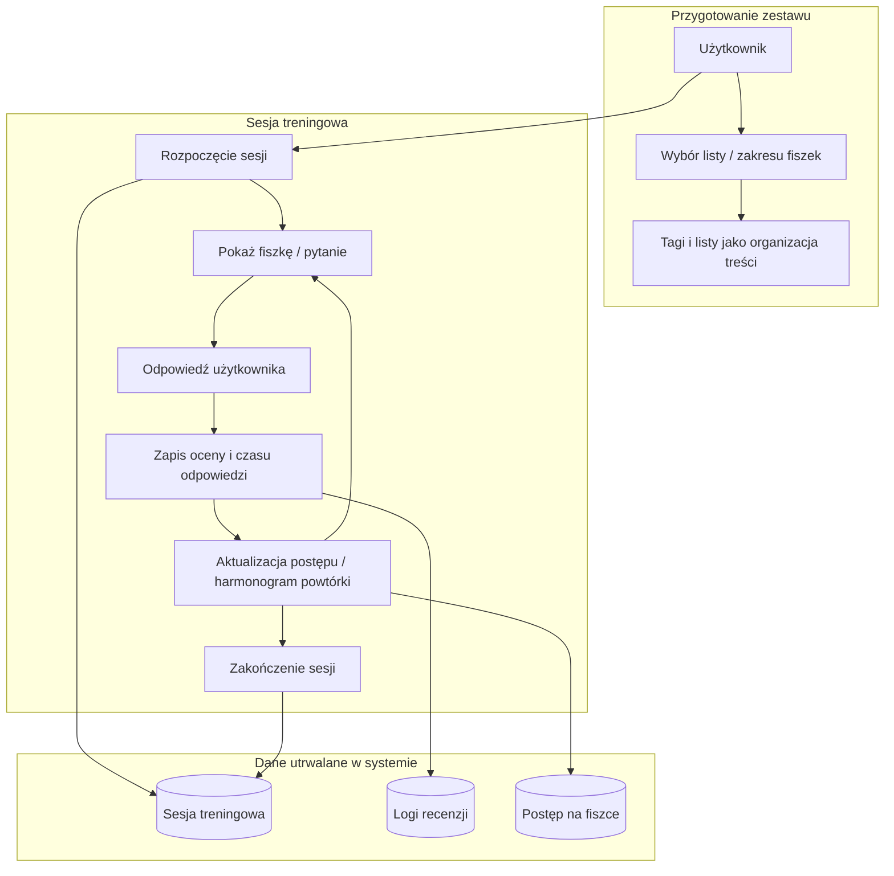
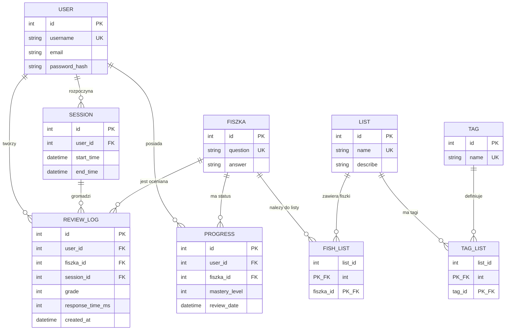

# Projekt: System nauki fiszek (Spaced Repetition)

## Opis
Projekt realizuje plan stworzneia narzędzia wspierającego proces nauki , z wykorzystaniem programowania obiektowego. Wstępnie materiał będzie realizowany w postaci fiszek oraz nauki słówek. Program zakłada zbieranie metadanych sesji użytkownika w celu budowy sieci algorytmów ewaluacyjnych oraz predykcyjnych dla techniki spaced repetition.

## Techstack
- **Język:** Python
- **ORM:** SQLAlchemy 2.x, SQLite — plik bazy memory.db w katalogu projektu (tworzony przy pracy aplikacji; nie commituje się do repo).

## Struktura katalogów i plików
```
 Ścieżka | Opis |
|:--------|:-----|
| `main.py` | Punkt wejścia aplikacji CLI |
| `cli.py` | Menu tekstowe i obsługa poleceń użytkownika, w tym sesji treningowej |
| `models.py` | Definicje modeli SQLAlchemy (typed ORM: `Mapped`, `mapped_column`) i konfiguracja SQLite |
| `db_crud.py` | Wspólna klasa `BaseCRUD` i klasy CRUD dla encji |
| `app/persistence/session.py` | Dostęp do sesji DB (`get_db_session`) |
| `app/domain/answer_validation.py` | Walidacja odpowiedzi użytkownika (obecnie 0/1, exact match po normalizacji) |
| `app/domain/scheduling.py` | Logika harmonogramu powtórek (`schedule_next_review`) |
| `app/services/progress.py` | Obsługa postępu użytkownika i budowy zakresu nauki |
| `app/services/deck_builder.py` | Budowanie talii fiszek użytkownika na podstawie `progress` |
| `app/services/training_session.py` | Start i zakończenie sesji treningowej |
| `app/services/review_service.py` | Zapis recenzji (`review_logs`) i aktualizacja `progress` |
| `app/services/word_import.py` | Import fiszek z plików `.txt/.csv` |
| `app/services/word_file_format.py` | Parser linii `question;answer` i normalizacja danych wejściowych |
| `tests/test_word_file_format.py` | Testy parsera linii importu |
| `tests/test_word_import.py` | Testy importu fiszek do bazy |
| `tests/test_smoke.py` | Plik testów smoke (obecnie pusty / do rozbudowy) |
```

## Plan funkcjonalny: sesja treningowa

Poniższy diagram opisuje mierzalny proces nauki (logika produktu), a nie dokładny stan tabel w SQLite. Szczegóły wdrożenia są w `models.py`.


## Architektura bazy danych



Projekt zakłada modułową budowę, która pozwala na utrzymanie czystego kodu oraz łatwą rozbudowę. 

## Nazwy tabel w SQLite (mapowanie)

| Encja na diagramie | Rzeczywista nazwa tabeli |
|:-------------------|:-------------------------|
| USER | `users` |
| SESSION | `sessions` |
| FISZKA | `fiszka` |
| REVIEW_LOG | `review_logs` |
| PROGRESS | `progress` |
| LIST | `lists` |
| FISH_LIST | `fiszka_list` |
| TAG_LIST | `tag_lists` |
| TAG | `tag` |

## Model danych i refaktor ORM

Projekt korzysta z SQLAlchemy 2.x oraz typed ORM (`Mapped`, `mapped_column`), co poprawia:
- czytelność typów w kodzie,
- kompatybilność z narzędziami statycznej analizy,
- bezpieczeństwo dalszej rozbudowy warstwy domenowej.

Kluczowe ograniczenia i zależności:
- `progress`: unikalność pary `(user_id, fiszka_id)`,
- `sessions`: unikalność pary `(user_id, start_time)`,
- `review_logs` przechowuje dane recenzji: `grade`, `response_time_ms`, `created_at`.

## Instalacja zależnosci

```bash
   python -m venv .venv
   .\.venv\Scripts\activate
   pip install -r requirements.txt
```
## Jak uruchomić?

### Program:
    ```bash
    python main.py
    ```
### Testy:
    ```bash
    python -m pytest
    ```
## Funkcjonalności:

### Działa
- CLI menu główne i menu kontekstowe.
- CRUD użytkowników.
- CRUD fiszek.
- Import fiszek z plików (`.txt`/`.csv`) z obsługą duplikatów i błędnych linii.
- Dodawanie fiszek do nauki użytkownika (`progress`).
- Sesja treningowa:
  - wpisywanie odpowiedzi przez użytkownika,
  - automatyczna walidacja odpowiedzi (0/1),
  - automatyczne wyliczanie oceny,
  - zapis recenzji do `review_logs`,
  - aktualizacja harmonogramu i poziomu opanowania w `progress`.

### W trakcie / planowane
- Rozbudowa walidatora odpowiedzi o tolerancję literówek.
- Rozbudowa strategii harmonogramowania o bardziej zaawansowane heurystyki/algorytmy.
- Pełna obsługa list i tagów w warstwie CLI.
- Szersze pokrycie testami (sesja treningowa, review service, scheduling, walidator odpowiedzi).

## Aktualny flow sesji treningowej (MVP)
1. Użytkownik wybiera opcję sesji treningowej i podaje `user_id`.
2. System buduje talię na podstawie rekordów `progress` użytkownika.
3. Dla każdej fiszki:
   - wyświetlane jest pytanie,
   - użytkownik wpisuje odpowiedź,
   - odpowiedź jest walidowana automatycznie względem poprawnej odpowiedzi fiszki,
   - mierzony jest czas odpowiedzi (`response_time_ms`),
   - system wylicza ocenę (`grade`) automatycznie (na podstawie `is_correct` i czasu),
   - zapisywany jest `review_log`,
   - aktualizowany jest `progress` (`mastery_level`, `review_date`).
4. Sesja jest zamykana przez ustawienie `end_time` w tabeli `sessions`.
W MVP użytkownik **nie wpisuje oceny ręcznie** — ocena jest wyłącznie automatyczna.